# **High-Quality Medical Image Synthesis Using Transformer-Enhanced Denoising Diffusion Models**

## **Project Overview**
In Healthcare, Medical Imaging is crucial for accurate diagnosis, treatment planning, and monitoring of disease progression. Generating high-quality medical images for training Machine Learning models is challenging due to data privacy concerns and the need for large annotated datasets. This project proposes the development of a Transformer-enhanced Cascaded Super Resolution Denoising Diffusion Probabilistic Model (SRDDPM) to synthesize high-quality 2D medical images. Leveraging a SWIN transformer within SRDDPMs aims to improve the stability and quality of generated images compared to existing methods like GANs and VAEs. The model will be trained and validated using the MRNet knee MRI dataset from Stanford University Medical Center. The expected outcome is a robust generative model capable of producing high-quality medical images, significantly aiding in training AI systems without compromising data privacy.

## **Contributions**
This project presents a Cascaded Super-Resolution DDPM consisting of three DDPM architectures: one designed to generate a lower-resolution image and the subsequent two cascaded to progressively upscale the image to a high resolution. The model is trained on the MRNet dataset, focusing on knee MRI images related to musculoskeletal abnormalities. The model is enhanced by utilizing a UNet architecture with a Swin-transformer block in the UNet's bottleneck layer for improved local and global feature learning, which is crucial for high-resolution medical images.

Furthermore, this project includes a comprehensive comparison of the performance of the cascaded Super-Resolution DDPM with other approaches. It compares:
- The cascaded Super-Resolution DDPM against a single-stage DDPM architecture trained directly on images of the same size.
- The cascaded Super-Resolution DDPM with and without the Swin-transformer blocks in the UNet architecture.
- The Super-Resolution models with interpolation methods to test the quality of upscaled images.

## **Dataset Information**
- **Dataset**: Stanford MRNet
- **Description**: The dataset consists of 1,370 knee MRI exams from Stanford University Medical Center, including 1,104 exams with ACL and meniscal tear labels manually extracted from clinical reports.
- **Reference**: Bien, Nicholas, et al. "Deep-learning-assisted diagnosis for knee magnetic resonance imaging: development and retrospective validation of MRNet." PLoS medicine 15.11 (2018): e1002699.

## **Models and Architectures**

1. **Proposed Architecture**
   - **64x64 Image Generator (Base DDPM):** 
     This model uses a UNet architecture with sinusoidal positional embeddings, self-attention, and cross-attention mechanisms to generate 64x64 images from noise. The Swin Transformer is integrated into the bottleneck layer to capture both local and global dependencies.
     
    
     
     
   - **Super-Resolution UNet (SR1 and SR2):** 
     The SR1 model upscales images from 64x64 to 128x128, and the SR2 model further upscales them to 256x256. These models do not include self-attention or cross-attention layers but have the Swin Transformer in the Bottleneck of UNet to refine image details effectively.

     
   - **Pipeline Overview:** 
     The following image depicts the overall pipeline of the proposed Cascaded Super-Resolution DDPM. It starts with the base DDPM generating low-resolution images, which are progressively upscaled using the SR1 and SR2 models.

     
      
2. **SRDDPM Without Swin Transformer**
   - This model follows the same cascaded approach but excludes the Swin Transformer from the architecture, reducing computational complexity while still performing the image upscaling tasks.

3. **Single-Stage 256x256 DDPM**
   - This model is a single-stage DDPM trained to generate 256x256 resolution images directly from noise. It incorporates the Swin Transformer within the UNet architecture to enhance the model’s ability to capture image details and does not have any other attention mechanisms.


## **Evaluation Metrics**

### **Phase 1: Super-Resolution Models Evaluation**

**Metrics:**
- **PSNR (Peak Signal-to-Noise Ratio):** Measures the overall quality of the upscaled images by comparing the signal's power to the noise's power. Higher PSNR values indicate better image quality with less noise.
- **SSIM (Structural Similarity Index Measure):** Evaluates the similarity between the original and upscaled images based on luminance, contrast, and structure, with values closer to 1 indicating better similarity.
- **FSIM (Feature Similarity Index Measure):** Assesses image quality by comparing perceptual features, focusing on phase congruency and gradient magnitude.
- **LPIPS (Learned Perceptual Image Patch Similarity):** A perceptual metric that measures the similarity of image patches in a way that aligns with human perception. Lower LPIPS values indicate better perceptual quality.
- **AG (Average Gradient):** Quantifies the sharpness of images by measuring the gradient of pixel intensities, with higher values indicating sharper images.
- **VIF (Visual Information Fidelity):** Evaluates the amount of visual information preserved in the upscaled images relative to the reference images.

### **Phase 2: Generative Models Evaluation**

**Metrics:**
- **FID (Frechet Inception Distance):** Measures the distance between the distributions of generated and real images, with lower values indicating that the generated images are closer to the real data.
- **IS (Inception Score):** Assesses both the quality and diversity of the generated images. Higher IS values indicate that the generated images are both diverse and recognizable.

## **Results**

#### **Phase 1: Super-Resolution Model Evaluation**


The **Cascaded SR model with Swin Transformer** excelled in image quality, achieving the highest PSNR (27.1742) and superior edge preservation (AG: 0.2634) compared to other models. Its perceptual quality, indicated by a low LPIPS score (0.1753), was also strong, though it required the longest training time (6 hours). The **Cascaded SR model without Swin Transformer** performed well with a slightly higher PSNR (27.6868) but showed reduced perceptual accuracy, making it more computationally efficient with only 3 hours of training. **Bicubic and Lanczos interpolation methods** were effective in preserving fine details but fell short in overall structural and perceptual accuracy compared to the SR models.

#### **Phase 2: Generative Model Evaluation**


The **SRDDPM with Swin Transformer** demonstrated strong structural refinement (FID: 85.9790, IS: 1.7970 ± 0.06) but required 9 hours of training. The **Single-Stage 256x256 DDPM** outperformed the SRDDPM in FID (61.9056) and IS (1.9876 ± 0.2776), producing sharper, more detailed images, though at the cost of greater computational resources (8 hours). The **SRDDPM without Swin Transformer** showed the weakest performance, with a higher FID (166.7589) and noisier images, requiring 5 hours of training, which highlights the Swin Transformer's importance in achieving higher-quality outputs.


While the Single-Stage DDPM leads in image quality, the SRDDPM with Swin Transformer offers scalability and versatility, making it a promising candidate for medical imaging tasks. With further enhancements, such as advanced attention mechanisms, the SRDDPM could potentially surpass the Single-Stage DDPM in overall performance, balancing quality with computational efficiency.


## **Libraries used in the Project:**
- **Python**: Ensure you have Python 3.x installed.
- **PyTorch**: The core library for building and training deep learning models.
- **TorchVision**: A package that provides datasets, models, and transformations specific to computer vision tasks.
- **TorchMetrics**: Provides a set of metrics for evaluating models, including FID and Inception Score.
- **Pandas**: For handling data in CSV files and DataFrames.
- **Pillow**: A library for opening, manipulating, and saving many different image file formats.
- **Matplotlib**: A library for creating static, animated, and interactive visualizations in Python.
- **NumPy**: For numerical computing, handling arrays, and performing mathematical operations.
- **SciPy**: Used for scientific and technical computing, including entropy calculations and matrix operations.
- **Tqdm**: A library for adding progress bars to loops.
- **Scikit-learn**: For calculating pairwise distances and other machine learning utilities.
- **TorchIO** (optional based on imports): A library for medical image preprocessing and augmentation.
- **OpenCV (cv2)**: Used for Lanczos, Bicubic, and Bilinear interpolation.
- **image-similarity-measures**: Used for calculating FSIM and other image similarity metrics.

To install all necessary dependencies, you can run:
```bash
pip install torch torchvision torchmetrics pandas pillow matplotlib numpy scipy tqdm scikit-learn torchio opencv-python image-similarity-measures
```

## **Usage/Generate Images with the Model**
This project includes multiple Jupyter notebooks, each designed for a specific purpose, such as loading datasets, training models, and generating synthetic images. To get started, you can run the `Pipelinemain_MRNet.ipynb` notebook, which guides you through importing saved model checkpoints and running the model for image generation.

**Running the Pipeline**

To run the pipeline, you will need to install the required dependencies. You can do this by running the following command:

```bash
pip install torch torchvision pandas pillow matplotlib numpy scipy tqdm
```

After installing you can run the `Pipelinemain_MRNet.ipynb` notebook.

## **Project Structure**
The project is organized as follows:

- **Evaluation Code**: Contains generated images and comparison images between SR models and interpolation methods. It also contains the code used for evaluating the Models.
- **DDPM_256x256**: Code for the training of 256x256 DDPM model and its savepoint.
- **Model_Savepoints**: Directory containing savepoints for all trained models.
- **Mrnet**: Contains dataset files and a subset of the preprocessed slices (located in `train_slices_raw` and `valid_slices_raw`). This will give an idea of the structure of the Dataset.
- **Training Images**: Includes images generated by the model during different epochs of training.
- **Jupyter Notebooks**:
  - `mrnet_load_trial.ipynb`: Performed loading and preprocessing of the MRNet dataset.
  - `DDPM_64x64Generator.ipynb`: Training of the DDPM with SWIN transformer in its UNet.
  - `DDPM_64x64Generator_(NOSWIN).ipynb`: Training of the DDPM without SWIN transformer in its UNet.
  - `SR1-(64-128).ipynb`: Training of the SR DDPM for 64x64 to 128x128 upscaling with SWIN transformer in its UNet.
  - `SR1-(64-128)(NoSWIN).ipynb`: Training of the SR DDPM for 64x64 to 128x128 upscaling without SWIN transformer in its UNet.
  - `SR2-(128-256).ipynb`: Training of the SR DDPM for 128x128 to 256x256 upscaling with SWIN transformer in its UNet.
  - `SR2-(128-256)(NOSWIN).ipynb`: Training of the SR DDPM for 128x128 to 256x256 upscaling without SWIN transformer in its UNet.
  - `Pipelinemain_MRNet.ipynb`: Main pipeline notebook for loading saved models and generating images.

## **Training Information**
All models were trained using an NVIDIA A100 GPU with 40 GB VRAM provided by the University of Birmingham BlueBEAR. 

## **Examples**

### **Generated Images Comparison**

#### **Model 1: SRDDPM with Swin Transformer**
<div align="center">
  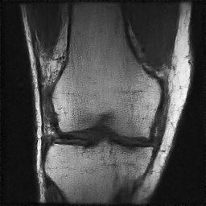
  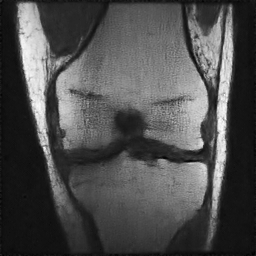
  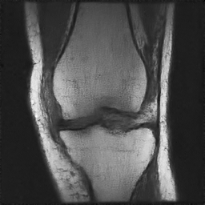
</div>

#### **Model 2: SRDDPM without Swin Transformer**
<div align="center">
  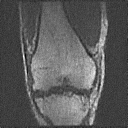
  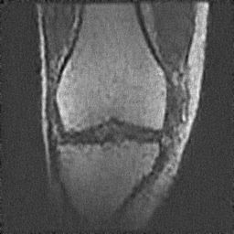
  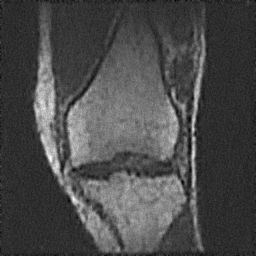
</div>

#### **Model 3: Single-Stage 256x256 DDPM**
<div align="center">
  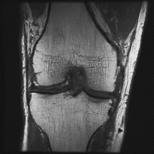
  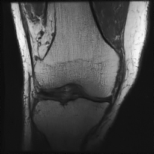
  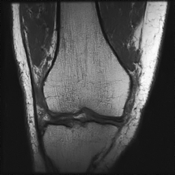
</div>

### **Super-Resolution Images Comparison between SWIN incorporated / no SWIN and interpolation methods**
#### **Model with SWIN and interpolation methods**
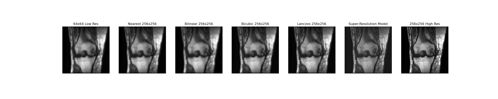
#### **Model without SWIN and interpolation methods**
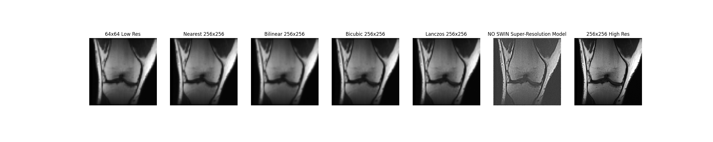


## **References**
- **DDPM Implementation**: Adapted from Ho, Jonathan, Ajay Jain, and Pieter Abbeel. "Denoising diffusion probabilistic models." Advances in neural information processing systems 33 (2020): 6840-6851. [DDPM by Jonathan Ho](https://github.com/hojonathanho/diffusion/tree/master).
  
- **Swin Transformer**: Refer to Liu, Ze, et al. "Swin transformer: Hierarchical vision transformer using shifted windows." Proceedings of the IEEE/CVF international conference on computer vision. 2021. [Hierarchical Vision Transformer using Shifted Windows](https://arxiv.org/abs/2103.14030).

- **2D Medical Image Synthesis using Transformer-based DDPM**: Pan, Shaoyan, et al. "2D medical image synthesis using transformer-based denoising diffusion probabilistic model." Physics in Medicine & Biology 68.10 (2023): 105004. [2D Medical Denoising Diffusion Probabilistic Model Implementation](https://github.com/shaoyanpan/2D-Medical-Denoising-Diffusion-Probabilistic-Model-/tree/main).

- **GH-DDPM**: Zhang, Sicheng, et al. "GH-DDM: the generalized hybrid denoising diffusion model for medical image generation." Multimedia Systems 29.3 (2023): 1335-1345. [GH-DDPM](https://link.springer.com/article/10.1007/s00530-023-01059-0).

- **Super-Resolution of Brain MRI Images**: Wu, Zhanxiong, et al. "Super-resolution of brain MRI images based on denoising diffusion probabilistic model." Biomedical Signal Processing and Control 85 (2023): 104901. [Super-Resolution of Brain MRI Images](https://www.sciencedirect.com/science/article/pii/S1746809423003348).


## **Abbreviations**
- **DDPM**: Denoising Diffusion Probabilistic Model
- **SRDDPM**: Super-Resolution Denoising Diffusion Probabilistic Model
- **UNet**: U-Net (a U-shaped convolutional neural network architecture)
- **SWIN**: Shifted Window Transformer
- **VAE**: Variational Autoencoder
- **GAN**: Generative Adversarial Network
- **VQVAE**: Vector Quantized Variational Autoencoder
- **SR1**: Super-Resolution Model 1 (64x64 to 128x128 upscaling Model)
- **SR2**: Super-Resolution Model 2 (128x128 to 256x256 upscaling Model)
- **MSE**: Mean Squared Error
- **SSIM**: Structural Similarity Index Measure
- **FSIM**: Feature Similarity Index Measure
- **PSNR**: Peak Signal-to-Noise Ratio
- **LPIPS**: Learned Perceptual Image Patch Similarity
- **AG**: Average Gradient
- **VIF**: Visual Information Fidelity
- **FID**: Frechet Inception Distance
- **IS**: Inception Score
- **NOSWIN**: Without SWIN transformer

